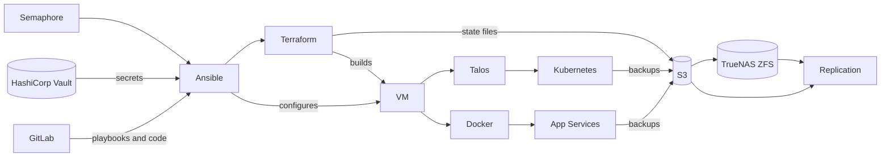

# Design

## Goals
Starting in 2026 I revamped my focus into full GitOps design. This is a step-by-step process to migrate my whole infra but the idea is that we have nothing to hide in our design if we properly manage secrets and vars the rest of the lab is a reusable, PII-free design.
1. Utilize IaC and GitOps principles whereever possible
2. Focus on a lab that can be scaled, rebuilt, replaced easily with no data loss.
3. Focus on tools that are industry standard rather than ones that might focus on OSS or "Homelab" style solutions, where reasonable.
4. Hybrid Cloud Design, putting copies of critical services throughout on-prem, remote sites (VPN), and public cloud.

## Core

Core services must never depend on the platforms they are responsible for deploying. This makes a full rebuild possible after a total failure. For example, GitLab and HashiCorp Vault run on dedicated VMs rather than in Docker or Kubernetes, because both of those platforms are deployed from GitLab using secrets stored in Vault. Hosting either one on the platforms they deploy would create a chicken-and-egg problem.

The same rule applies to the foundation beneath them:

- **Proxmox** hosts the VMs for GitLab, Vault and the Kubernetes nodes. It is installed directly on the hardware and needs nothing it hosts in order to boot or run, so it can be recovered before anything else.
- **OPNsense** provides routing, VLANs and DNS for every other service. Ansible is planned to manage its configuration, but the firewall runs independently of that automation, so the network stays up even when everything that configures it is down.
- **TrueNAS** provides storage and hosts the Docker services. Those services are deployed from GitLab and Vault, so they sit above the core rather than inside it. TrueNAS itself must never rely on them to operate.

## Backups

Every layer is backed up independently, so any application, VM or host can be restored at whichever level fits the failure. This creates overlap between backups, and that overlap is intentional: if one layer's backup is missing or corrupt, the layer above or below it can still recover the data.

### By layer

| Layer | What | How |
|---|---|---|
| Application | Docker Apps | Volume-level backups via Docker Volume Backup Manager |
| Application | VM Apps | Each application's native backup tool, run by Ansible. Where the native tool omits configuration or secrets, Ansible backs those up alongside it. Built so far: Plex, and GitLab's configuration; planned: GitLab's data, KASM, Hashicorp Vault |
| Application | Kubernetes Apps | Persistent Volume Claims backed up via Longhorn |
| Configuration | Appliances: devices whose state is defined by their configuration rather than by an operating system, whether physical or virtual (OPNsense, Brocade switches, TrueNAS) | Each appliance's native configuration export (planned) |
| Hypervisor | Proxmox Virtual Machines | Proxmox VM backups |
| Configuration in Git | Application configuration that is useful to others: Semaphore task templates, the Homepage dashboard | Kept in this repo with site values replaced by inventory variables or generic examples, so it doubles as a backup and as a reusable example |

### Configuration in Git

Some applications are configured mostly through their own UI or API, and that configuration is worth sharing on its own: anyone running the same tool can reuse it. Those configurations are kept in Git, PII-free, next to the code they run:

- **Semaphore**: every task template, in `semaphore/templates/`, with the project resources they name described in `semaphore/README.md`
- **Homepage**: the dashboard layout, in `docker/homepage/config/`, rendered from the inventory and pushed by `portainer/push-config.yaml`

Git history makes these versioned backups as well, and a rebuilt application can be set up again from them.

## Replication

| What | How |
|---|---|
| Datasets | TrueNAS Replicates Datasets to an Offsite instance. |
| S3 | Garage Replicates across the cluster (Offsite) |
| PVC | Persistent Volume Claims are Replicated Across all Talos nodes |
| etcd | All three control-plane nodes replicate etcd. |

### What isn't backed up?

- **Ephemeral Resources** Things like runners, that spin up to perform a task, or exist only to complete tasks. These resources can be rebuilt from Git without requiring any data to be restored to them.

- **Talos nodes** Hosting our Kubernetes, we consider Talos nodes to be replaceable. Restoring a single control-plane VM from an old image brings back a stale etcd member, which can break the cluster. Talos nodes are rebuilt from their machine configuration instead, and etcd snapshots restore the data.

### Monitoring and Maintenance

Uptime Kuma monitors services and hosts that do not have their own integrations for monitoring somewhere else. 

I personally have everytihng configured for Discord notifications.

the inventory defines the organizations and monitors of each app.

DVBM supports Kuma natively for maintenance windows and ansible maintenance will call the maintenance playbook before rebooting services or hosts.

### Schedule and retention

Backups run daily.

# Branching

Changes are pushed to the `dev` branch. When every CI check passes on a `dev` commit, CI fast-forwards `main` to that commit, so `main` only ever holds commits that passed linting, validation and the PII scan. Semaphore and Flux follow `main`.

# Terraform
Terraform is used to provision resources. Where things are done dynamically, Ansible may call Terraform in order to inject secrets and variables at runtime.

Terraform state is stored in S3, hosted by Garage, which is planned to run as a Cluster, with each Garage container running on a different TrueNAS Scale instance.

# Secrets
All code in the Repo will use Vars for Non-sensitive PII, that will be read from my Inventory (not in this repo), and then secrets are stored in Hashicorp Vault per-application and read by the task var_lookup.yaml.

Each Application, and each shared service credential such as Proxmox, Garage or Cloudflare, has its own path in the Vault.

# Inventory

# Flow

